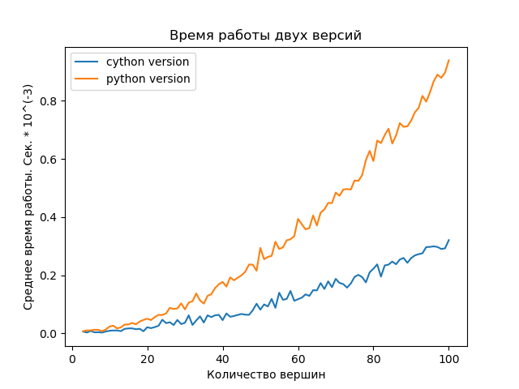

# Отчёт. Алгоритм топологической сортировки с поиском в глубину

## Реализация алгоритма

### Шаги:
1) Помечаем все вершины равными 0;
2) Делаем рекурсивный обход в глубину;
3) При посещении вершины, помечаем её 1;
4) Если у вершины нет путей к вершинам, помеченными 0, то помечаем её 2, помещаем в стек и возвращаемся к предыдущей вершине;
5) Когда все вершины помечены 2, полученный стек и является топологически отсортированным.
6) Достаем вершины из стека и задаем им значения 1...N в порядке получения. (N - число вершин)

[Реализация python версии](src/python_version)

## Сложность алгоритма

Сложность алгоритма равна O(V + E), где V - количество вершин, а E - количество ребер.
Таким образом сложность равна сложности обхода в глубину, так как отличие заключается лишь
в наличии стека.

## Оптимизация

В качестве оптимизации был использован модуль Cython, который в качестве надомножества Python позволяет с помощью
определенного синтаксиса генерировать и компилировать код на C и запускать совместно с кодом на Python.

[Реализация cython версии](src/cython_version)

## Сравнение

Был создан [бенчмарк](benchmark.py), который запускает сортировку для графов с 3...K вершин по N раз каждый и замеряет
среднее время работы для каждого количества вершин. В примере ниже были запущены графы с количеством вершин 
от 3 до 100 по 100 примеров для каждого.

Как видно из графика, особенно на большом количестве вершин, скорость работы 
на cython в несколько раз выше. Также видно, что графики не линейны, так как в данной реализации,
количество связей между вершинами варируется от количества вершин до количсетва вершин в квадрате, 
а как был сказано в одном из предыдущих этапов, сложность работы алгоритма O(V + E).Результаты бенчмарка 
показывают, что реализация на python работает в среднем за 0.0003 секунды, а реализация на cython за 0.0001 секунду.
Соответсвенно прирост по скорости работы в 3 раза. Всё благодаря скорости работы языка C.

## Вывод

1) Реализована топологическая сортировка с помощью Python.
2) Вычислена сложность работы алгоритма, равная O(V + E).
3) Реализована оптимизированная топологическая сортировка с помощьюю Cython.
4) Проведено сравнение и получен прирост по скорости в 3 раза.
